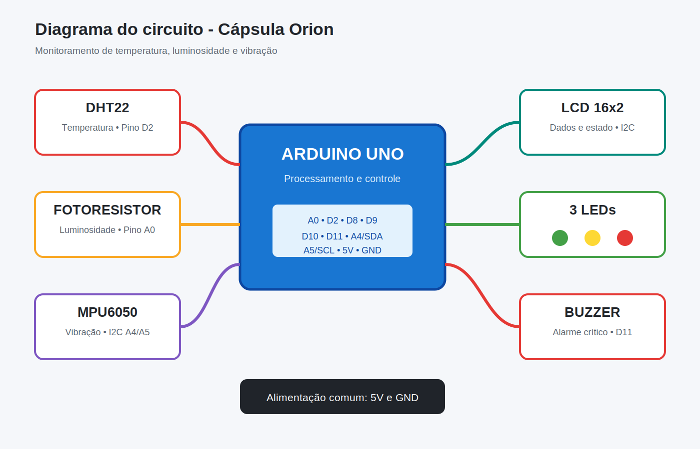
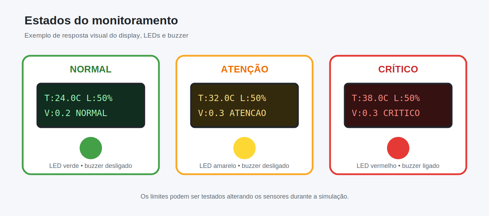

# Sistema IoT para Monitoramento de Cápsula Espacial

Projeto da Global Solution 2026 do primeiro semestre de Ciência da Computação.

## Objetivo

O projeto simula o monitoramento das condições internas de uma cápsula espacial. O sistema faz leituras de temperatura, luminosidade e vibração, mostra os dados em um display e ativa alertas quando encontra alguma situação de risco.

## Componentes

- Arduino Uno
- Sensor de temperatura DHT22
- Sensor de luminosidade fotoresistor
- Sensor de movimento MPU6050
- Display LCD 16x2 com comunicação I2C
- LED verde, LED amarelo e LED vermelho
- Três resistores de 220 ohms
- Buzzer

## Funcionamento

O DHT22 mede a temperatura interna da cápsula. O fotoresistor representa a iluminação do módulo. O MPU6050 mede a aceleração e permite identificar vibrações ou impactos.

O display mostra continuamente as três medições e a situação geral da cápsula.

- `NORMAL`: LED verde aceso.
- `ATENCAO`: LED amarelo aceso.
- `CRITICO`: LED vermelho e buzzer ativados.

## Diagrama do circuito

## Estados do monitoramento

## Limites utilizados

### Temperatura

- Normal: entre 18 °C e 30 °C.
- Atenção: entre 15 °C e 18 °C ou entre 30 °C e 35 °C.
- Crítico: abaixo de 15 °C ou acima de 35 °C.

### Luminosidade

- Normal: entre 20% e 85%.
- Atenção: entre 5% e 20% ou entre 85% e 95%.
- Crítico: abaixo de 5% ou acima de 95%.

### Vibração

- Normal: até 1,0 m/s².
- Atenção: acima de 1,0 m/s².
- Crítico: acima de 3,0 m/s².

## Arquivos

- `sketch.ino`: código do Arduino.
- `diagram.json`: componentes e ligações do circuito no Wokwi.
- `libraries.txt`: bibliotecas usadas pela simulação.
- `ROTEIRO_VIDEO.md`: roteiro para o vídeo de até três minutos.

## Como executar

1. Abra o projeto no Wokwi.
2. Clique no botão verde para iniciar a simulação.
3. Altere a temperatura do DHT22, a luminosidade do fotoresistor ou os valores do MPU6050.
4. Observe as mudanças no LCD, nos LEDs, no buzzer e no monitor serial.

## Validação técnica

- Código compilado para Arduino Uno sem erros.
- Uso de 51% da memória de programa e 42% da memória dinâmica.
- Circuito aprovado pelo linter oficial do Wokwi sem erros ou avisos.

## Integrante

Gabriel Castilla Cavaloti

## Repositório

https://github.com/GabrielCavaloti/capsula-espacial-iot

## ODS relacionada

O projeto se relaciona com a ODS 9 - Indústria, Inovação e Infraestrutura, pois apresenta uma solução de monitoramento com sensores, sistema embarcado e alertas automáticos.
